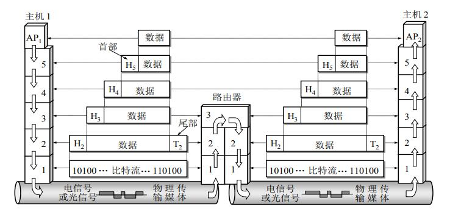
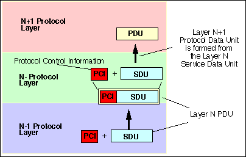
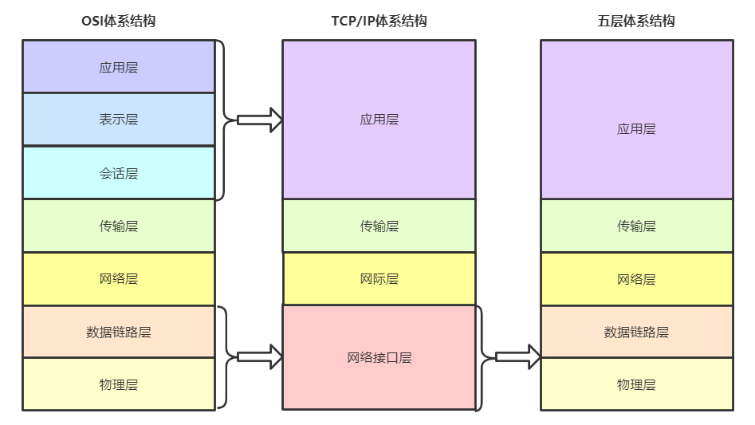

## 协议与划分层次

**网络协议**：为进行网络中对等实体数据交换而建立的规则、标准或约定。

> 网络协议也可简称为**协议**，更进一步讲，网络协议主要由以下三个要素组成：
>
> * 语法：数据与控制信息的结构与格式；
> * 语义：需要发出何种控制信息，完成何种动作以及做出何种响应；
> * 同步：事件实现顺序的详细说明
>

ARPANET的研制经验表明，对于非常复杂的计算机网络协议，其结构应该是**层次式**的。

> 文献中还可以见到术语 **协议栈**，因为信息在层级间的传递和处理类似栈的结构。
>

网络的**体系结构**就是**计算机网络各层及其协议的集合**。

* **实体**：任何可以发送或接收信息的硬件或软件进程。
* **协议**：控制两个对等实体（或多个实体）进行通信的规则的集合
* **接口**：（访问服务点 SAP）上层使用下层的接口
* **服务**：下层为相邻上层提供的功能调用

> 在协议的控制下
>
> * 向上一层提供服务：控制两个对等实体间的通信
> * 使用下一层的服务：使用层间接口提供下层服务
>
> 所以，协议是水平的，服务是垂直的。
>

## 七层协议体系结构

OSI的七层协议体系结构，概念清楚，理论完整，但它既复杂又不实用。

```plantuml
@startuml

node node[
7 应用层
----
6 表示层
----
5 会话层
----
4 运输层
----
3 网络层
----
2 数据链路层
----
1 物理层
]

@enduml
```

> 开放系统互连基本参考模型 OSI/RM （Open Systems Interconnection Reference Model）
>

## 四层协议体系结构

TCP/IP被广泛的应用，它是一个四层体系结构，实现较OSI简单。

```plantuml
@startuml

node node[
4 应用层（各种应用层协议：如TELNET，FTP，SMTP等）
----
3 运输层（TCP或UDP）
----
2 网际层（IP）
----
1 网络接口层
]

@enduml
```

## 五层协议体系结构

学习计算机网络原理过程中采取的折中体系架构。

```plantuml
@startuml

node node[
5 应用层
----
4 运输层
----
3 网络层
----
2 数据链路层
----
1 物理层
]

@enduml
```

## 不同协议体系结构对应关系：

## 五层协议体系结构中各层作用

结合互联网的情况，从上而下、简明扼要的介绍各层主要功能。

#### 应用层（application layer）

应用层的任务是 **通过应用进程间的交互来完成特定网络应用**。

应用层定义的是 **应用进程间通信和交互的规则**。

应用层交互的数据单元是 **报文**（message）。

> 不同的网络应用要有不同的应用层程序，常见的应用层协议：
>
> * 域名系统 DNS
> * 万维网应用 HTTP
> * 支持电子邮件 SMTP
> * 文件传输 FTP
> * ...
>

#### 运输层（transport layer）

运输层的任务是 负责向**两台主机间进程之间的通信**提供**通用的数据传输服务**。

> 1. 应用层利用该服务传递报文
> 2. 通用性与多进程决定运输层具有 **复用** 和 **分用** 的功能：
>    * 复用：多个应用层进程可使用下面的运输层服务
>    * 分用：运输层把受到的信息分别交付应用层相应进程
>

运势层主要使用以下两种协议：

* **传输控制协议 TCP**（Transmission Control Protocol）：面向连接的、可靠的数据传输服务，其数据传输的单位是 **报文段**（segment）
* **用户数据包协议 UDP**（User Datagram Protocol）：提供无连接的、尽最大努力（best-effort）的数据传输服务，其数据传输的单位是 **用户数据报**

#### 网络层（network layer）

网络层的任务是 为分组交换网上的不同 **主机** 提供通信服务。

网络层在发送数据时，把运输层产生的 报文段 或 用户数据报 封装成 **分组** 或 **包** 进行传送。

> 网络层使用 IP协议（Internet Protocol，网际协议），所以也可称为 **IP数据报**。
>

#### 数据链路层（data link layer）

链路层的任务是 将网络层交下来的IP数据报**组装成帧**（framing），并在两个相邻链路上传送 **帧**（frame）。

#### 物理层（physical layer）

物理层的任务是**传递比特数据**（不解释比特的意义）。物理层解释多大电压代表 “1”，多大电压代表“0”，以及接收方如何识别发送方所发送的比特。

> 物理层还要确定连接电缆的插头应该有多少引脚以及各引脚应该如何连接。
>
> 物理层之下的物理介质（媒介）并不在物理层之内。
>