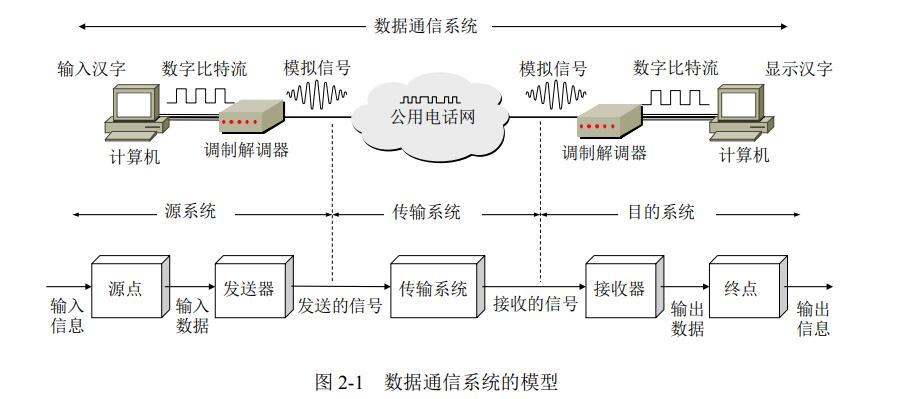
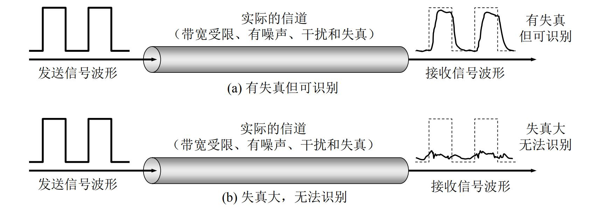

## 典型的数据通信模型

> 通信的目的是 **传送消息**
>

## 数据通信系统的模型

数据通信系统可划分为三大部分：

1. 源系统（发送端、发送方）
   * 源点（source）：源点设备产生要传送的数据。
   * 发送器：通常源点生成的数字比特流要通过发送器编码才能够在传输系统中进行传输。
2. 目的系统（接收端、接收方）
   * 接收器：接受传输传送过来的信号，并把它转换为能够被目的设备处理的信息。
   * 终点（destination）：终点设备从接收器获取传送的比特流。
3. 传输系统（传输网络）
   > 可以是简单的传输线，也可以是连接在源系统和目的系统之间复杂网络系统
   >

## 数据通信常用术语

* **数据**（data）：使用特定方式表示的信息，通常是有意义的符号序列。
* **信号**（signal）：数据的电气或电磁的表现。
  1. 模拟信号（连续信号）：代表消息的参数取值是连续的
  2. 数字信号（离散信号）：代表消息的参数取值是离散的
* 信源：产生和发送信息的源头
* 信宿：接受数据的终点
* 信道：信号的传输媒介。
  > 一般用来表示向某一个方向传送信息的介质，因此一条通信线路往往包含一条发送信道和一条接收信道。
  >

  1. 按照**传输信号**分类：
     * 模拟信道：传送模拟信号
     * 无线信道：传送数字信号
  2. 按照**传输介质**分类：
     * 无线信道
     * 有线信道

## 通信信息交互方式

1. **单向通信**（**单工通信**）
   只能有一个方向的通信，而不能有反向的交互。
   > 仅需要一条信道
   >
2. **双向交替通信**（**半双工通信**）
   通信的双方都可以发送或接收消息，但任何一方都不能同时发送和接受
   > 需要两条信道
   >
3. **双向同时通信**（**全双工通信**）
   通信的双方可以同时发送和接收信息
   > 需要两条信道
   >

## 常见数据传输方式

1. **串行传输**
   > 速度慢，费用低，适合远距离，用于远距离数据的传输
   >
2. 并行传输
   > 速度快，费用高，适合近距离，常用于计算机内部数据
   >

## 码元、速率、波特、带宽

“计算题常考计算题的点”

### 码元

码元指用一个**固定时长**的**信号波形**（数字脉冲），代表不同离散数值的基本波形。

> 码元是数字通信中数字信号的基本单位，该**固定时长内的信号**成为**k进制码元**，而该**固定时长**称为**码元宽度**。
>

### 速率

速率也叫**数据率**，是指数据的**传输速率**，表示单位时间内传输的数据量。

> 发送速率，可以用 **码元传输速率** 和 **信息传输速率** 表示。
>

1. **码元传输速率**（码元速率、波形速率、调制速率、符号速率）
   用以表示 **单位时间内 数字通信系统所传输的 码元 个数**（也可以称为**脉冲个数**或者**信号变化的次数**）。
   > 单位为 **波特**（**Baud**），1波特 表示数字通信系统每秒传输一个码元。
   >
2. **信息传输速率**（信息速率、比特率）
   表示单位时间内数字通信系统传输的二进制码元个数（即比特数）
   > 单位是 比特/秒 (b/s，或bps)
   >

* 两者关系：
  > 若一个码元携带 n bit 的信息量，则 M Baud的码元传输速率所对应的信息传输速率为 M×n bit/s 。
  >

## 带宽

表示在单位时间内从网络中的某一点到另一点所能通过的“最高数据率”，常用来表示网络的通信线路所能传输数据的能力，单位是b/s。

## 奈氏准则与香农定理

 “考研计算重点考察”

### 失真

又称畸变，指信号传输过程中与原有信号或标准相比发生的偏差。

> 根据偏差的程度：
>
> * 失真但可识别
> * 失真无法识别
>
> 影响失真程度的因素：
>
> 1. 码元传输速率
> 2. 信号传输距离
> 3. 噪声干扰
> 4. 传输媒体质量
>

### 码间串扰

所谓码间串扰是由于系统传输总特性不理想，导致前后[码元](https://baike.baidu.com/item/%E7%A0%81%E5%85%83/10525003)的波形畸变、展宽，并使前面波形出现很长的拖尾，蔓延到当前码元的抽样时刻上，从而对当前码元的判决造成干扰。

“In **telecommunication**, **intersymbol interference** ( **ISI** ) is a form of **distortion** of a **signal** in which one **symbol** interferes with subsequent symbols.”

> 在任何信道中，码元传输的速率是有上限的，传输速率超过此上限，就会出现严重的码间串扰的问题，使接收端对码元的判决（即识别）称为不可能
>

### 带通调制

下图给出了最基本的调制方法：

* 调幅(AM)： 即载波的振幅随基带数字信号而变化。
  > 例如，0 或 1 分别对应于无 载波或有载波输出。
  >
* 调频(FM) ：即载波的频率随基带数字信号而变化。
  > 例如，0 或 1 分别对应于频率 f1或 f2。
  >
* 调相(PM) ：即载波的初始相位随基带数字信号而变化。
  > 例如，0 或 1 分别对应于 相位 0 度或 180 度。
  >

为了达到更高的信息传输速率，必须采用技术上更为复杂的多元制的振幅相位混合调制方法。

> 例如：正交振幅调制QAM（Quadrature Amplitude Modulation）
>
> 例题：某通信线路的波特率是1200Baud，采用4个相位， 每个相位有4种振幅的QAM调制技术，则该链路的信息传输速率是多少？
>
> $$
> V_{Info} = 1200\ Baud × log_2(4*4)\ bit = 4800\ bps
> $$
>
> 所以，该链路的信息传输速率为 4800bps。
>

### 奈氏准则

在理想低通（无噪声、带宽受限）的条件下，为了避免码间串扰，极限码元传输速率为 $2W$ Baud，W是信道带宽，单位是Hz。

> 本质上是限制了码元的传输速率
>

那么理想低通信道下的极限数据传输率：

$$
极限数据率 = 2Wlog_2V
$$

> 其中，W为带宽（Hz），V为码元的离散信号个数
>
> ！！！注意：只有在上述场景，带宽才用Hz
>

> 1. 任何信道中，码元的传输速率是由有上限的。如果超过次上限，就会出现严重的码间串扰问题，使接收端对于码元的正确识别称为不可能
> 2. 信道的频带越宽（即能通过的信号高频分量越多），就可以用更高速率进行码元的有效传输
> 3. 奈氏准则给出了**码元传输速率**的限制，但没有对**信息传输速率**给出限制。
>    > 由于码元的传输速率受到奈氏准则的制约，所以要提高数据的传输速率，就必须设法使每个码元能携带更多个比特的信息量，这就需要采用**多元制**的调制方法。
>    >
>

### 香农定理

计网中常见的香农定理指代的是香农三大定理中的香农第二定理：

**有噪信道编码定理**：

* 当信道的信息传输率不超过信道容量时，采用合适的信道编码方法可以实现任意高的传输可靠性；
* 当信息传输率超过了信道容量，就不可能实现可靠的传输。

**信噪比**：

所谓信噪比就是信号的平均功率和噪声的平均功率之比，常记为 S/N。

$$
信噪比（dB）= 10\ log_{10}(S/N)\ (dB)
$$

> 以上是使用分贝（dB）为度量单位时的信噪比公式
>

**香农公式**：

信道的极限信息传输速率 C：

$$
C = W\ log_2(1+S/N)\ \ (bit/s)
$$

> 式中，W为信道的带宽（单位Hz），S为信道内所传信号的平均功率，N为信道内部的高斯噪声功率。
>
> 公式中可以看出：对于一定的传输带宽和一定信噪比，唯一确定传输速率上限
>

香农公式表明：**信道的带宽或信道中的信噪比越大**，**信息的极限传输速率就越高**。

香农公式意义：只要**信息传输速率低于极限值**，**必然存在某种方法实现无差错传输**。

## 两者对比

| 奈氏准则（内忧）                         | 香农定理（外患）                   |
| ---------------------------------------- | ---------------------------------- |
| 带宽受限，无噪声条件下，为了避免码间串扰 | 带宽受限有噪声的条件下信息传输速率 |
| 理想低通信道：$2Wlog_2V$                   | 极限数据传输率：$Wlog_2(1+S/N)$      |
| 提高带宽 / 采用更好的编码技术            | 提高带宽 / 提高信噪比              |

> **题目**：**二进制信号在信噪比 127:1 的 4kHz 信道上传输，最大的数据速率可达到多少**？
>
> 1. 根据奈氏准则
>    $$
>    V_{Nyquist} = 2Wlog_2V = 4×10^3\ ×\ log_2(2) = 8kbps
>    $$
> 2. 根据香农定理
>    $$
>    V_{Shannon} = Wlog_2(1+S/N) = 4×10^3Hz*log_2(1+127/1) = 28kbps
>    $$
>
> 所以，在该条信道上最大的数据率可达到 8kbps。
>

## 基带信号与宽带信号

**信道**：信号的传输媒介，一般用来表示向某一个方向传送信息的介质，因此一条通信线路往往包含一条发送信道和一条接收信道。

1. 按照传送信号分类：
   * 模拟信道：传送模拟信号
   * 数字信道：传送数字信号
2. 按照传输介质分类：
   * 无线信道
   * 有线信道

信道上传的信号：

* **基带信号**：将数字1和0直接用两种不同的电压表示，再送到数字信道上去传输（基带传输）
  > 来自信源的信号，就是发出的直接表达了要传输信息的信号。对于计算机来说，来自信源（计算机）发送的信号就是二进制信号
  >
* **宽带信号**（**带通信号**）：将基带信号**调制**后形成的频分复用模拟信号传送到模拟信道上去传输（宽带传输）
  > 现在明白调制解调器是什么作用了吧O(∩_∩)O哈哈~，主要是因为之前没钱所以用电话线路的模拟信号的信道。
  >

## 编码与调制

由于系带信号不适合直接在信道上传输，所以需要进行**调制**。

* **基带调制**（**编码** coding）：
  将数字信号转化为另一种形式的数字信号
* **带通调制**
  使用载波（carrier）进行调制，把基带信号的频率范围搬移到较高的频段，并转化为模拟信号。
  > 经过载波调制后的信号成为带通信号。
  >

### 常用编码方式

* **不归零制**：正电平代表 1，负电平代表 0
* **归零制**：正脉冲代表 1，负脉冲代表 0
* **反向不归零编码**：信号电平翻转表示 0， 信号电平不变表示 1.
* **曼彻斯特编码**：位周期中心的向上跳变代表 0，位周期中心向下跳变代表 1
* **差分曼彻斯特编码**：在每一位中心都有跳变，位于开始边界有跳变代表 0，而位开始边界，没有跳变代表 1

> 从信号波形可以开出，Manchester编码产生的信号频率比不归零制高
>
> 从自同步能力来看，不归零制不能从信号波形本身提取信号始终频率（没有自同步能力），而曼彻斯特编码具有自同步能力
>

#​#