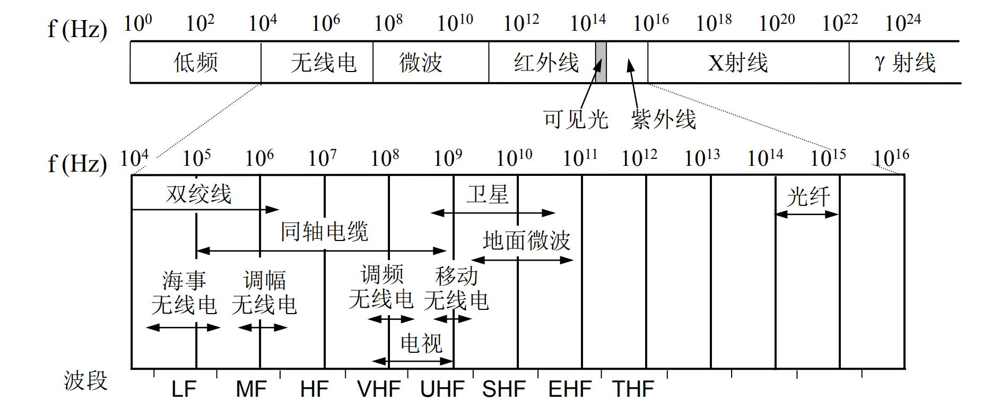
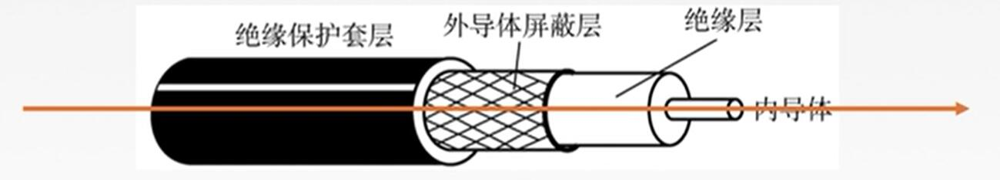

**传输介质**也称**传输媒体**/**传输媒介**，它就是数据传输系统在发送设备和接收设备之间的**物理通路**。

> 传输介质是在物理层之下的，有时称作网络体系结构的第0层
>

传输介质（媒体）可以分类为：

* 导向性传输介质（导引型传输媒体）
  > 电磁波 被导向 沿着固体媒介（铜线/光纤）传播。
  >
* 非导向性传输介质（非导引型传输媒体）
  > 自由空间，介质可以是空气、真空、海水。
  >

### 导向性传输介质（导引型传输媒体）

#### 1. 双绞线

把两根互相绝缘的铜导线并排放到一起，然后用规则的方法**绞合**（twist）起来就构成了双绞线。

> * 绞合可以较少相邻导线之间的电磁干扰
> * 为了进一步提高抗干扰能力，可以在双绞线外面加上一层用金属层编织成的屏蔽层
>

#### 2. 同轴电缆

同轴电缆由 **导体铜制芯线**、**绝缘层**、**网状编织屏蔽层**和**塑料外层**构成。

> 按照特性阻抗数值的不同，通常将同轴电缆分为两类：50Ω同轴电缆
>